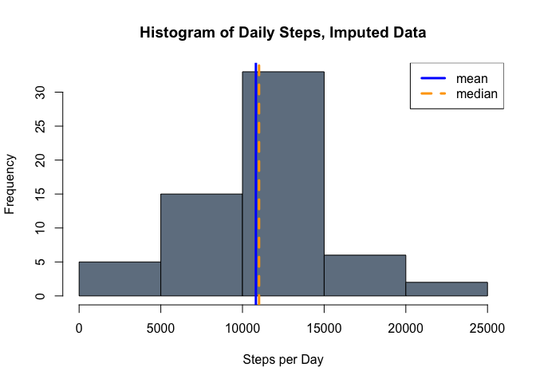

# Reproducible Research: Peer Assessment 1

## Package dependencies

Before we get started with loading the data, we should load all of the libraries that we will need for our analysis.


```r
library(ggplot2)    # facet plotting
library(lubridate)  # date handling
library(scales)     # for the date_format function
```

## Loading and preprocessing the data

We'll start by unzipping the data if necessary, and then reading it in with `read.csv`.


```r
if(!file.exists("activity.csv")) { 
    unzip("activity.zip")
}
activity <- read.csv("activity.csv")
```

Now that we have the data, let's convert the `date` field to a proper date class and add a `datetime` field for plotting purposes. Surprisingly, lubridate's `hm` and `hms` functions don't handle the `interval` field gracefully (they seem to need a delimiter of some sort, unlike `ymd` and friends). The easiest way I could think of to get a delimiter in there was to divide the interval by 100 to separate the minutes from the hours, then print the result to a string with the format `"%.2f"`.


```r
activity$date <- ymd(activity$date)
activity$datetime <- activity$date + hm(sprintf("%.2f", activity$interval/100))
```

## What is mean total number of steps taken per day?

Now we can move on to the analysis. First, we are interested in the distribution of the total number of steps taken each day. We begin by summing steps by date using the `aggregate` function. We ignore missing values, as indicated by the `na.action=na.omit` option. However, as this is the default, we will omit this option in the future.


```r
dailySteps <- aggregate(steps ~ date, data=activity, sum, na.action=na.omit)
meanDailySteps <- mean(dailySteps$steps)
medianDailySteps <- median(dailySteps$steps)
# plot the histogram
lwd <- 3 # set a consistent line width
hist(dailySteps$steps, col="slateGray", 
     main="Histogram of Daily Steps", 
     xlab="Steps per Day")
abline(v=meanDailySteps, col="blue", lwd=lwd)
abline(v=medianDailySteps, col="orange", lty=2, lwd=lwd)
legend("topright", col=c("blue", "orange"), legend=c("mean", "median"),
       lty=c(1,2), lwd=lwd)
```

 

As the figure above indicates, the mean and median numbers of daily steps over the two months sampled are very close:


```r
meanDailySteps
```

```
## [1] 10766.19
```

```r
medianDailySteps
```

```
## [1] 10765
```

The mean is 10766.19 and the median is 10765.

## What is the average daily activity pattern?

We can get an idea of the average daily activity pattern by calculating the mean number of steps in each 5-minute interval, averaged across all days. This can be accomplished by aggregating with the `mean` function.


```r
intervalSteps <- aggregate(steps ~ interval, data=activity, mean)
```

This will plot more nicely if we use an x-axis in an appropriate date-time format, so we will grab the first 288 values (one day) of `datetime` from the full dataset.


```r
intervalSteps$time <- activity$datetime[1:288]
plot(steps ~ time, data=intervalSteps, type="l", 
     main="Average Daily Activity Pattern", xlab="Time", ylab="Steps")
```

 

It looks like the peak activity occurs sometime before 9:00 a.m. on average. We can make this more precise by looking for the maximum value in `intervalSteps`.


```r
intervalSteps[with(intervalSteps, which(steps == max(steps))),"interval"]
```

```
## [1] 835
```

On average, the greatest number of steps occurs during the 5-minute interval beginning at 8:35 a.m.

## Imputing missing values

Our dataset has missing values, and we would like to investigate the impact of replacing them with reasonable approximations of their likely values. First, let's find out how many and which records are missing.


```r
missingRecords <- which(is.na(activity$steps))
print(numMissing <- length(missingRecords))
```

```
## [1] 2304
```

There are 2304 missing 5-minute intervals in the dataset. 


```r
numMissing/288
```

```
## [1] 8
```

This is the equivalent of 8 days of data. As it turns out, we are missing exactly 8 days of data:


```r
length(unique(activity[missingRecords, "date"]))
```

```
## [1] 8
```

This means that we will have to impute full days' worth of data, rather than filling in scattered missing intervals. It seems likely that activity patterns vary by the day of week (*i.e.*, Sunday, Monday, etc.), so we will fill the missing values with the mean daily activity pattern averaged over the samples we have for the same day of week. Let's start by adding a column to our dataset to indicate the day of week, using the `wday` function from lubridate.


```r
activity$wday <- wday(activity$date)
```

Now we just need to make a copy of our data, iterate over the missing dates and fill them in with the appropriate average.


```r
imputedActivity <- activity
missingDates <- unique(activity[missingRecords, "date"])
for (i in seq_along(missingDates)) {
    imputeRange <- which(activity$date == missingDates[i])
    impute <- aggregate(steps ~ interval,
                        data=subset(activity, wday == wday(missingDates[i])), 
                        mean)
    imputedActivity$steps[imputeRange] <- impute$steps
}
```

Let's take a look at the distribution of the imputed data.


```r
imputedDailySteps <- aggregate(steps ~ date, data=imputedActivity, sum)
imputedMeanDailySteps <- mean(imputedDailySteps$steps)
imputedMedianDailySteps <- median(imputedDailySteps$steps)
# plot the histogram
hist(dailySteps$steps, col="slateGray", 
     main="Histogram of Daily Steps, Imputed Data", 
     xlab="Steps per Day")
abline(v=imputedMeanDailySteps, col="blue", lwd=lwd)
abline(v=imputedMedianDailySteps, col="orange", lty=2, lwd=lwd)
legend("topright", col=c("blue", "orange"), legend=c("mean", "median"),
       lty=c(1,2), lwd=lwd)
```

 

In the imputed dataset, the mean and median numbers of daily steps are a bit different than in the raw dataset:


```r
imputedMeanDailySteps
```

```
## [1] 10821.21
```

```r
imputedMedianDailySteps
```

```
## [1] 11015
```

So in our imputed dataset, we see small increases in our estimates of mean and median daily steps, with a larger increase in the median. A more subtle consequence of our imputation strategy can be seen by comparing the distributions of daily steps in the two cases. Although we could try to do this with the histograms we already plotted, it will be easier too look at smoothed densities plotted together.


```r
rawDensity <- density(dailySteps$steps)
imputedDensity <- density(imputedDailySteps$steps)
plot(rawDensity, main="Density of Daily Steps", xlab="Daily Steps",
     type="l", lwd=lwd, col="blue", ylim=c(0,1.3e-4))
lines(imputedDensity, col="orange", lwd=lwd)
legend("topright", lty=1, col=c("blue", "orange"), lwd=lwd, 
       legend=c("raw", "imputed"))
```

 

As we can see from the above plot, the number of daily steps in the imputed dataset is concentrated more toward the center of the distribution. This suggests a reduction in variance. This is probably a consequence of imputing with mean values rather than doing something more sophisticated like a reseampling scheme.

## Are there differences in activity patterns between weekdays and weekends?

We already have the day of week in our dataset from the imputation exercise above, so there is no need to use the `weekdays` function to create a factor variable distinguishing weekdays from weekends. The help for `wday` indicates that Sunday and Saturday are encoded as 1 and 7, respectively, so `ifelse` and `factor` will do the trick.


```r
dayClass <- with(activity, 
                 ifelse(is.element(wday, c(1,7)), "weekend", "weekday"))
activity$dayClass <- factor(dayClass)
```

Now we can use `aggregate` as before, but we need to include an additional term in our expression to group by time interval and type of day. We'll also add a `time` column as before to make our plots prettier.


```r
dayClassIntervalSteps <- aggregate(steps ~ interval + dayClass, 
                                   data=activity, mean)
dayClassIntervalSteps$time <- rep(activity$datetime[1:288],2)
qplot(time, steps, data=dayClassIntervalSteps, geom="line", 
      main="Average Daily Activity Pattern", xlab="Time", ylab="Steps") + 
    facet_wrap(~dayClass, nrow=2) + 
    scale_x_datetime(labels=date_format("%H:%M"))
```

 

The weekday and weekend activity patterns do appear to differ. The weekday pattern shows a strong peak between 8:00 and 9:00 a.m. (maybe a morning commute) and lower levels of activity throughout the day (maybe a desk job). In contrast, the weekend pattern generally shows a more consistent level of activity, lower than the weekday peak but higher than the weekday trough. Finally, the weekend activity pattern starts and ends a little later than on weekdays.
